# Project plan

## Delivery model

One product owner and one primary engineer can deliver the remaining Phase 0A
and Phase 0B evidence. The Phase 0B architecture review has replaced the former
Windows/Harken estimate with a provisional .NET MAUI combined-product range,
but physical Android evidence still controls whether Phase 1 may start.
Independent security/privacy review is required before device pairing or
federation. The owner remains the decision authority for use case, sources,
retention, platforms, and release scope.

## Phase 0 work breakdown

| Work package | Output | Nominal effort | Status |
|---|---|---:|---|
| Baseline audit | Capability and gap matrix | 0.5 day | Complete |
| Product definition | Charter, users, scope, non-goals | 0.75 day | Complete and owner-approved |
| Codebase decision | Harken assessment and .NET MAUI probe ADR | 0.75 day | Architecture recommendation complete; production acceptance blocked |
| UX definition | Navigation, flows, states, visual concept | 1 day | Complete and owner-approved |
| Technical foundation | Architecture and data contract | 1 day | Definition complete; physical implementation evidence blocked |
| Data/source governance | Source register and lifecycle | 0.75 day | Review complete; three sources approved-disabled for local trial |
| Relay-use-case definition | Standalone-message contract, ADR, and aggregate cross-source evidence | 0.5 day | Source/transport sub-gate passed; matcher precision/label gate failed |
| Independent-device definition | Windows/Android lifecycle and pairing boundary | 0.5 day | Complete; Android selected |
| Mobile foundation spike | Background probes, shared contract, architecture ADR, revised estimate | 8-12 focused days | Windows primitive probe complete; Android/device/packaging evidence blocked |
| Verification design | Measures, tests, and requirement traceability | 1 day | Complete; 62 requirements mapped to planned automation/UI evidence |
| Roadmap/backlog | Phases, sequence, estimates, gates | 0.75 day | Complete and rebased |
| Readiness review | Resolve decisions and approve Phase 1 | 0.5 day | Complete: no-go until E-001 and E-002 close |

## Milestones

- **M0 Baseline understood:** current prototype and candidate base assessed.
- **M1 Product boundary accepted:** purpose, user, signal definition, scope, and
  prohibited uses approved.
- **M2 Experience and data accepted:** UI flows, record fields, retention, stop,
  and deletion agree.
- **M3 Architecture accepted:** provisional application foundation,
  components, relay/source gate, Phase 0A fit check, and federation deferral
  approved.
- **M4 Evidence accepted:** corpus, measures, tests, risks, and source approval
  process approved.
- **M5 Definition ready:** the backlog is ordered and Phase 0A/0B may begin.
- **M5A Relay fit proven:** a bounded read-only spike confirms the selected
  stream, standalone classifier, source limits, and application foundation.
- **M5B Mobile foundation proven:** physical-device probes confirm truthful
  lifecycle behaviour and an accepted Windows/Android architecture.
- **M6 Phase 1 ready:** both spikes pass, estimates are rebased, and no blocking
  decision remains.

## Phase 0 spikes and Phase 1 implementation backlog

Estimates are focused engineering days for one experienced developer and are
planning ranges, not commitments. The Phase 0B report supersedes the former
Windows-only Harken baseline with this combined .NET MAUI range.

| Order | Epic | Main output | Estimate | Depends on |
|---:|---|---|---:|---|
| 1 | Relay suitability closure | Improve the matcher on development fixtures; freeze an owner-approved fresh held-out set; pass the 85% precision and 60% recall gate while retaining the completed Nostr/Jetstream source evidence | 2-4 days | M5 |
| 1B | Complete mobile foundation evidence | Pinned toolchain; Android service/notification/STOP, encrypted-store, physical resource, APK/AAB/MSIX evidence | 8-12 days | 1 |
| 2 | Repository, MAUI shell and CI fixtures | Pinned .NET 10 solution and target builds | 5-7 days | 1B |
| 3 | Shared contracts and reducer | Domain/state contracts and cross-platform parity harness | 8-12 days | 2 |
| 4 | Nostr source path | WebSocket, size/rate/queue bounds, signature/classification, dedup/provenance | 9-13 days | 3 |
| 5 | Encrypted vault | Key hierarchy, encrypted SQLite blobs, retention, capacity, deletion | 12-18 days | 3 |
| 6 | Matching and discovery | Validated matcher, spam/Junk, waterfall, topics and Keep lifecycle | 10-14 days | 3-5 |
| 7 | Shared station UI | Onboarding, Now, Signals, Watches, Sources, data/deletion, accessibility | 14-20 days | 3-6 |
| 8 | Android lifecycle | Foreground service, notification STOP, locking, limits and coverage gaps | 8-12 days | 3-7, 1B |
| 9 | Packaging | Windows MSIX and Android APK/AAB install/upgrade/uninstall | 5-8 days | 7, 8 |
| 10 | Verification and hardening | Security/no-egress, corpus, parity, lifecycle and resource evidence | 14-20 days | 4-9 |
| 11 | Operator/release documentation | Setup, source/contact, privacy, recovery and release gates | 3-5 days | 9, 10 |

The current combined Phase 1 planning range is **88-129 focused engineering
days**, roughly **18-26 focused weeks** for one experienced engineer or 12-17
elapsed weeks for two engineers with one integration owner. Phase 0B completion
(8-12 focused days plus elapsed battery/session time), device/tool procurement,
Play review, store/vendor licensing, legal review, and release waiting time are
outside that Phase 1 range. The range does not authorise Phase 1 while the
evidence gates remain red.

## Critical path

```mermaid
flowchart LR
    A["Local-only source rows approved"] --> S["Relay suitability spike"]
    S --> M["Mobile foundation spike"]
    M --> B["Confirm shared foundation"]
    B --> C["Domain, relay adapter, and source gate"]
    C --> D["Matcher and privacy projection"]
    D --> E["Listening desk"]
    E --> F["Stop and deletion"]
    F --> G["Evidence and Phase 1 gate"]
```

Platform UI shells can begin after the shared behavioural and domain contracts
and proceed alongside matcher implementation. Network federation cannot begin
on this path; it has a separate Phase 3 gate.

## Ownership

| Responsibility | Accountable role |
|---|---|
| Product purpose, sources, retention, and final scope | Product owner |
| Architecture, implementation, tests, upstream sync | Lead engineer |
| Phone lifecycle, packaging, and physical-device evidence | Mobile platform lead |
| Match corpus labels and acceptance threshold | Product owner + evaluator |
| Source approval and opt-out handling | Product owner |
| Security and privacy design review | Independent reviewer |
| Operations, keys, incident response, and emergency stop | Named operator; Phase 3+ |

## Change control

- A change that adds a new source, persistent field, outbound destination,
  person-level inference, or network message type requires a recorded decision.
- Phase scope moves only at a gate review.
- No later-phase feature is pulled forward merely because its supporting
  library is available.
- An upstream Harken update follows the pin and review policy in the technical
  foundation document.
