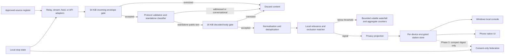

# Technical foundation

## Codebase decision

Do not create a production fork of
[Harken](https://github.com/VladUZH/harken). Retain it as a read-only product
reference. Use a greenfield .NET 10 MAUI solution as the foundation for the
next Windows/Android physical probe, with one shared C# behavioural core and
small native lifecycle/security shells.

This is a probe-foundation choice, not a passed production gate. The
[Phase 0B foundation report](PHASE_0B_FOUNDATION_REPORT.md) records ten passing
Windows .NET primitive checks but no Android build, device lifecycle,
foreground-service STOP, encrypted SQLite, resource, APK/AAB, or MSIX evidence.
[ADR 0006](../adr/0006-dotnet-maui-probe-foundation.md) therefore remains
proposed until those checks pass.

Harken is a Python 3.10+ application using FastAPI, Jinja, SQLite, Pydantic,
httpx, feedparser, Typer, pytest, and Ruff. Its published architecture already
provides the expensive general substrate:

```text
approved sources -> normalised Mention -> local analysis -> SQLite -> web UI / CLI
```

It includes pluggable source adapters, pagination and cursor state, failure
isolation, deduplication, a local dashboard, CLI, projects, alerts, auth,
retention tools, backup, Docker, health checks, metrics, and structured logs.
The project is MIT licensed.

Primary evidence:

- [Repository and architecture](https://github.com/VladUZH/harken)
- [Project dependencies](https://raw.githubusercontent.com/VladUZH/harken/main/pyproject.toml)
- [Source interface](https://raw.githubusercontent.com/VladUZH/harken/main/src/harken/sources/base.py)
- [Mention model](https://raw.githubusercontent.com/VladUZH/harken/main/src/harken/models.py)
- [MIT licence](https://raw.githubusercontent.com/VladUZH/harken/main/LICENSE)
- [Nostr basic relay/event protocol](https://github.com/nostr-protocol/nips/blob/master/01.md)
- [Nostr public text notes and reply structure](https://github.com/nostr-protocol/nips/blob/master/10.md)
- [AT Protocol Firehose and Jetstream](https://atproto.com/guides/streaming-data)
- [Current Jetstream v2 endpoints and limits](https://bsky.network/docs/jetstream/)
- [Phase 0A source qualification](PHASE_0A_SOURCE_REVIEW.md)

## Decision matrix

| Criterion | Current prototype | Harken fork | .NET 10 MAUI |
|---|---:|---:|---:|
| Public-source listening fit | 3/5 | 4/5 | 5/5 potential |
| Continuous relay-stream fit | 1/5 | 3/5 | 5/5 potential |
| Standalone mobile-station fit | 0/5 | 0/5 | 5/5 potential |
| Shared Windows/Android core | 0/5 | 1/5 | 5/5 potential |
| Existing ingestion adapters | 1/5 | 5/5 | 0/5 |
| Existing UI | 1/5 | 4/5 desktop web only | 0/5 |
| Privacy fit without changes | 4/5 | 2/5 | 5/5 potential |
| Native lifecycle/security access | 1/5 | 1/5 | 5/5 potential |
| Time to a useful Windows-only demo | 3/5 | 5/5 | 2/5 |
| Combined-product parity risk | 1/5 | 1/5 | 4/5 potential |
| Licence clarity | 1/5 | 5/5 | 5/5 |

Harken wins only the superseded Windows-only shortcut. Its Python polling,
FastAPI dashboard, accounts, exports, alerts, and brand-monitoring features do
not cover the shared classifier/state/vault/STOP work or an Android station.
MAUI offers the better boundary for this accepted product, subject to the
still-failed physical evidence gate. The current prototype remains a
requirements and regression archive, not production code.

## Adoption strategy

1. Close Phase 0A with a protocol-valid, aggregate-only source comparison.
2. Install and pin the .NET 10/MAUI, JDK, Android API 33/36, `adb`, emulator,
   and Windows packaging toolchain described by the Phase 0B report.
3. Build only the bounded MAUI probe: shared reducer and encrypted envelope,
   direct local-test WebSocket, Android foreground service/notification STOP,
   and Windows target.
4. Run the physical API 33/API 36 lifecycle, battery, network, locked-device,
   timeout, storage-sentinel, backup, deletion, and restart matrix.
5. Build/install/upgrade/uninstall the test APK/AAB and signed MSIX paths.
6. Accept ADR 0006 only when that evidence is green; otherwise reopen the
   reserved alternatives without weakening the product contract.
7. Create the greenfield production repository after both Phase 0A and Phase
   0B gates pass. Preserve Harken's URL/SHA/license only as research
   attribution if ideas or code are actually carried forward.
8. Keep this prototype as the Phase 0 requirements/regression archive and port
   contracts and fixtures intentionally.

## Upstream policy

- Never build from a floating upstream branch.
- Pin every accepted upstream state to a full 40-character SHA.
- Review upstream monthly, at phase gates, and for relevant security fixes.
- Perform updates on a dedicated `upstream-sync/YYYY-MM-DD` branch.
- Inspect code, licences, dependencies, migrations, and privacy behaviour.
- Run the upstream suite plus all Cyber Space Radio privacy and end-to-end tests.
- Record old and new SHAs, reviewer, evidence, and accepted or rejected changes.
- Prefer selective cherry-picks once downstream privacy or federation changes
  make routine merges expensive.

## Target architecture



### Component boundaries

- **Source registry:** the only authority that can enable a fetch endpoint.
- **Source adapters:** connect only to a configured relay/stream or retrieve
  from a configured feed/API; they do not discover sources or follow content
  links.
- **Incoming-envelope gate:** accept an assembled Nostr WebSocket event message
  only through 65,536 UTF-8 bytes, including its wrapper and tags. Enforce the
  limit before JSON parsing where the platform permits. Fragmented frames count
  as one assembled message; over-limit transport closures use normal backoff.
- **Protocol validator and standalone classifier:** verify the event envelope
  and signature when supported, then reject replies, quotes, reposts, direct or
  recipient-tagged messages, and group/channel messages before semantic work.
- **Decoded-body gate:** measure the candidate body as UTF-8 before
  normalization. Accept at most 16,384 bytes; larger bodies increment only a
  non-identifying `Oversized` counter and cannot reach spam, Junk, waterfall,
  matching, notification, or persistence. Frame, envelope, tag, queue, and
  parser-work bounds remain separate adapter controls.
- **Normaliser:** maps source results into the shared `CandidateMessage`
  contract; a retained Harken adapter may translate at its boundary.
- **Relevance service:** evaluates watch phrases, exclusions, and later an
  optional local embedding model. It never performs outreach.
- **Volatile waterfall:** holds a fixed-count, fixed-age in-memory preview of
  standalone shouts for discovery. It has no persistence, logging, export,
  backup, notification, browser-storage, or federation path.
- **Privacy projection:** decides which fields may persist. This sits before the
  store, not only in the UI. It encrypts matched-message content before the
  durable-store boundary.
- **Station store:** each device has its own encrypted local source of truth.
  SQLite remains the Windows candidate; Phase 0B selects and verifies the phone
  store without creating a shared operational dependency.
- **No-backend boundary:** every station connects directly to its enabled
  public sources. No project-operated service receives message content, event
  identifiers, watch configuration, matches, reports, or listening history.
- **Windows console:** provisionally loopback-only FastAPI and server-rendered
  Jinja; it is a process inside the installed application, binds only to the
  local device, and is not a hosted or LAN-accessible backend. Use small
  progressive interactions rather than introducing a separate SPA toolchain
  before Phase 0B settles the shared-core boundary.
- **Mobile station:** a platform-appropriate local application with the same
  behavioural contracts, its own encrypted store and keys, and explicit
  foreground/background state. It cannot be a thin remote control if it must
  operate independently.
- **Control state:** a durable local listening state gates every outbound source
  request. Listening is allowed only when control state is both `unlocked` and
  `listening`. Federation later adds a separately authenticated operating lease.
- **Federation adapter:** absent in Phase 1 and 2. It can later emit only compact
  digests defined by `FEDERATION_DESIGN.md`.

Any telemetry, crash reporting, cloud backup, remote push, sync, pairing, or
update mechanism must be evaluated as a separate outbound destination. Phase 1
permits no listening-data egress through any of them. See
[ADR 0005](../adr/0005-local-only-direct-source-architecture.md).

Signal inspection is local. An operator-invoked external Nostr viewer is a
separate, visible browser navigation rather than application telemetry: no
request is made until confirmation, and the URL contains only the configured
HTTPS viewer base plus a safely encoded stable event reference.

## Required domain contracts

These contracts apply to both stations. If Harken survives the gates, its
Windows implementation must conform rather than defining the cross-platform
contract.

| Addition | Purpose |
|---|---|
| `Watch` | Idea phrasings, exclusions, threshold, enabled state, and evaluation version. |
| `WatchTemplate` | Versioned bundled starter-topic definition with editable concepts, alternatives, exclusions, breadth, and validation status; instantiation creates only a local `Watch`. |
| `ApprovedSource` | Endpoint, owner, terms, interval, expiry/review date, and enabled state. |
| `SignalDecision` | One watch's score, explanation, matcher version, validation-evidence version, and decision time; a signal owns a set keyed by watch ID so multiple matches never duplicate message content. |
| `ObservedSourceSet` | Deduplicated approved source IDs that delivered one verified protocol event; drives provenance badges without duplicating the candidate. |
| `ExternalViewerSetting` | Optional local HTTPS viewer base and enabled state; defaults to disabled/null on installation and reset, accepts only a safely encoded stable event reference after explicit confirmation, and is never populated from received content. |
| `VolatileJunkEntry` | In-memory verified event, provenance, spam-rule version/reason, and expiry; never serialised and eligible only for an exact-event session restore. |
| `WaterfallPreview` | Unicode-grapheme-safe projection of at most 280 user-perceived characters from a volatile candidate; expansion references the same local item and never fetches content. |
| `CandidateBodyLimit` | Cross-platform 16,384-byte UTF-8 decoded-body boundary plus a non-identifying `Oversized` outcome; evaluated before normalization or content-based classification. |
| `InboundEnvelopeLimit` | Cross-platform 65,536-byte UTF-8 assembled-event-envelope boundary, enforced at transport intake where possible and reported only as an aggregate `Oversized` envelope outcome. |
| `RetentionPolicy` | Field-level storage and expiry choices. |
| `RetentionReasonSet` | Manual and per-watch keep reasons keyed by reason type/watch ID with decision time; non-empty means the single signal is protected, while final removal starts a new ordinary expiry. |
| `StorageCapacityPolicy` | Per-device hard byte limit, warning thresholds, protected usage, transaction headroom, pruning order, and storage-full state. |
| `StationState` | Requested mode, proven execution state (including background-limited or OS-suspended), locked/stopped state, last source activity, next permitted work, and coverage gaps. |
| `DeletionEvent` | Minimal audit that a scoped deletion occurred, without retaining deleted content. |
| `WatchDeletionPlan` | Transactional preview grouping other-watch survivors, manual-Keep survivors, ordinary deletions, protected deletions, and estimated bytes before removing one watch's definition, decisions, and topic-retention reasons. |
| `InboxViewState` | Memory-only filters, ordering, and scroll position scoped to one unlocked session; defaults to all topics ordered by first observation and clears on lock, STOP, restart, or reset. |
| `SignalReviewState` | Device-local `New`/`Reviewed` state and nullable review time on one deduplicated signal; successful unlocked inspection marks reviewed and `Mark as new` clears it without retention or notification effects. |
| `ReviewBatchPlan` | Current-filter snapshot of unique New signal IDs plus aggregate count; confirmation atomically marks that exact set Reviewed without decrypting message bodies. |
| `EncryptedSignalContent` | Versioned authenticated-encryption envelope for the full text of a durable topic match or explicitly kept shout and any required verification key. |
| `KeyState` | Locked/unlocked state, KDF and envelope versions, rotation metadata, and no passphrase or plaintext key material. |
| `KeyResetEvent` | Minimal audit that unreadable ciphertext and its wrapped key were purged before a new key was created; contains no key or deleted content. |

## Minimum persisted signal

```json
{
  "signal_id": "local-random-uuid",
  "protocol": "nostr",
  "observed_via_source_ids": ["phase0a-nostr-damus", "phase0a-nostr-nos-lol"],
  "event_reference": "protocol-stable-event-id",
  "dedup_key": "nostr:protocol-stable-event-id",
  "source_object_key": "nostr:protocol-stable-event-id",
  "entry_url": null,
  "message_text_ciphertext": "versioned-authenticated-encryption-envelope",
  "published_at": "2026-08-14T00:00:00Z",
  "observed_at": "2026-08-14T00:03:00Z",
  "review_state": "New",
  "reviewed_at": null,
  "matches": [
    {
      "watch_id": "watch-uuid",
      "score": 0.91,
      "explanation": ["semantic routing", "peer-to-peer"],
      "matcher_version": "relationship-gossip-context-v2",
      "validation_evidence_version": "watch-uuid/eval-1"
    }
  ],
  "retention_mode": "expiring",
  "retention_reasons": [],
  "expires_at": "2026-08-21T00:03:00Z"
}
```

The logical record contains the full public text of a topic-matched or
explicitly kept shout, but
the durable representation contains only its authenticated ciphertext. Author
profiles are absent. The source-ID set is minimal provenance and resolves to
the local approved-source register; duplicating relays do not duplicate the
signal. A protocol public key may be included inside the encrypted envelope
only when required for event verification. Federation never receives message
text, ciphertext, or author evidence.

`signal_id` is an opaque, random identifier local to one installation. It is
never a content fingerprint. `dedup_key` is derived from the protocol's stable
object identity and version: `nostr:<verified-event-id>` for Nostr and
`at:<at-uri>#<cid>` for a Jetstream post version. `source_object_key` is the
stable deletion target (`event ID` or `AT URI`) and lets an upstream delete
remove all retained versions of that public object. An implementation may use
a content fingerprint only as a short-lived spam/near-duplicate input; it must
never merge separate events merely because their text is identical.

`matches` is keyed by watch ID. Adding another matching watch updates the same
signal transactionally; it does not create another message row, unique-signal
count, notification, or content ciphertext. The inbox derives its topic chips
and filters locally from this set.

`retention_mode` is derived: it is `kept` and `expires_at` is null whenever
`retention_reasons` is non-empty. Reasons may be `manual` or `topic` with the
matching watch ID and decision time. Removing the final reason changes the mode
to `expiring` and sets a new seven-day deadline. The quota manager accounts for
database, indexes, WAL, audits, and bounded transaction headroom before
committing a durable write. It prunes expired and then oldest unkept records,
never protected ones, and returns a truthful storage-full result when no
compliant write can fit.

## Known Harken gaps

- Current records include raw text, author, URL, and query; the privacy
  projection must be introduced before relying on the store.
- Keyword retrieval is not semantic listening. Use a two-stage process:
  authorised candidate retrieval followed by local relevance scoring.
- Harken has no proven continuous Nostr or Jetstream adapter, standalone-event
  classifier, stream backpressure, or reconnect controller. Phase 0A owns this
  fit check.
- Hosted LLM analysis and webhooks can disclose content and remain visibly off
  by default.
- Harken is young and pre-1.0. It has no published release contract and needs a
  downstream security and dependency audit.
- SQLite is appropriate per station, not as a global federation database.
- Harken has no peer identity, node health, operating lease, or emergency
  network stop; those remain Phase 3 work.
- Harken cannot supply the standalone mobile runtime and is rejected as the
  production base. The proposed .NET MAUI replacement remains unaccepted until
  Phase 0B physical evidence proves its platform APIs, encrypted store,
  packaging, and background/STOP behaviour.
